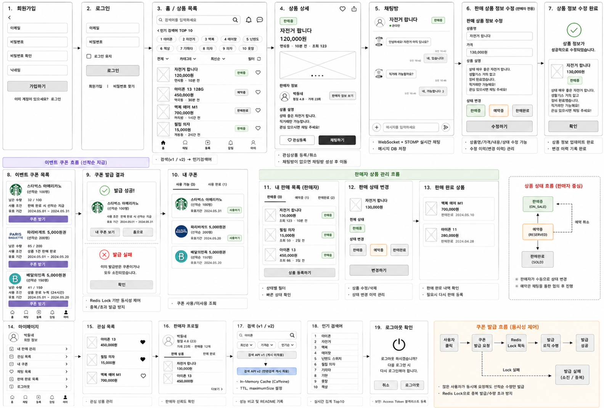
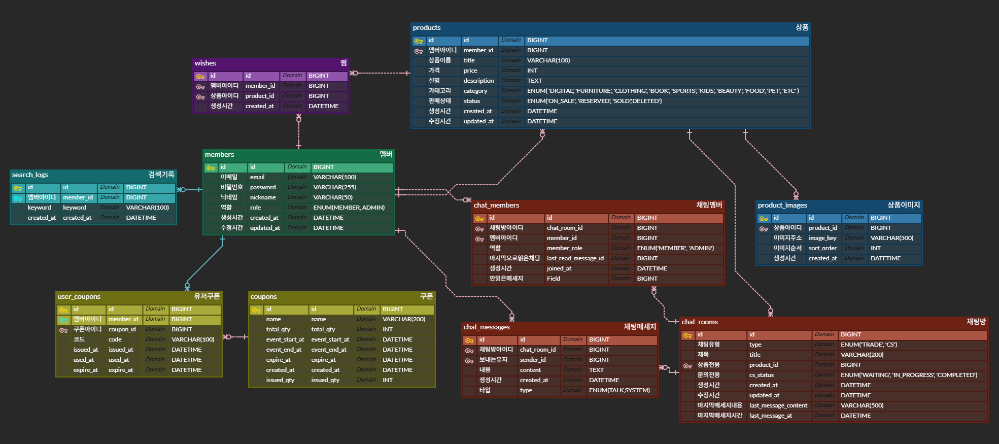

# 5pringUsedMarket

## 프로젝트 소개

중고 물품 거래, 실시간 채팅, 선착순 쿠폰 등 실제 중고거래 플랫폼의 핵심 기능을 구현한 Spring Boot 백엔드 프로젝트입니다.

---

## 팀원 및 담당 도메인

| 이름 | 담당 도메인 |
|------|------------|
| 김홍기 | 검색 / 인기검색어 |
| 김현승 | 인증 / 회원 |
| 황정후 | 상품 / 쿠폰 |
| 윤영범 | 실시간 채팅 |

---

## 기술 스택

| 분류 | 기술 |
|------|------|
| Language | Java 17 |
| Framework | Spring Boot 4.1.0, Spring Data JPA, Spring Security |
| Database | MySQL |
| Cache / Broker | Redis (캐시, Pub/Sub, 분산 락) |
| Real-time | WebSocket + STOMP + SockJS |
| Auth | JWT (Access Token + Refresh Token) |
| Infra | Docker, AWS EC2, GitHub Actions (CI/CD) |

---

## 주요 기능

- **인증 / 회원**: 회원가입, 로그인, JWT 기반 인증, Redis 블랙리스트 로그아웃
- **상품**: 상품 등록 / 수정 / 삭제 / 조회, 관심 상품, 선착순 쿠폰 발급 (Redis 분산 락)
- **검색 / 인기검색어**: 키워드 검색, Redis 캐시 기반 인기검색어
- **실시간 채팅**: WebSocket + STOMP, Redis Pub/Sub 다중 서버 브로드캐스트, 거래 / CS 채팅 구분

---

## 기술적 의사결정

<details>
<summary><strong>동시성 제어 — Redis 분산 락 (Lettuce)</strong></summary>

### 선택한 방식: Redis 분산 락 (Lettuce SETNX)

선착순 쿠폰 발급 기능은 동시에 수백 건의 요청이 쏟아지는 상황에서도 **발급 수량 초과 없이 데이터 정합성을 보장**해야 합니다.

### 락 방식 비교

| 방식 | 관리 주체 | 보호 범위 | 성능 특성 | 적합한 환경 |
|------|----------|----------|----------|------------|
| 낙관적 락 (`@Version`) | Hibernate | DB UPDATE 시점 | 충돌 적으면 빠름, 충돌 많으면 재시도 폭발 | 서버 1대, 충돌 드문 경우 |
| 비관적 락 (`PESSIMISTIC_WRITE`) | DB Row Lock | DB 트랜잭션 범위 내 | 대기 발생, 처리량 감소 | 서버 1대, 충돌 잦은 경우 |
| Redis 분산 락 (Lettuce) | Redis | 비즈니스 로직 전체 | 빠른 락 획득, TTL 자동 해제 | **다중 서버(Scale-out) 환경** |

### 선택 이유

- **비관적/낙관적 락은 DB 트랜잭션 범위만 보호**하므로, 조회 → 검증 → 수정 전체 비즈니스 흐름을 보호하지 못합니다.
- 서버가 여러 대인 환경에서는 각 서버의 JVM 락이나 DB 락만으로는 **서버 간 공유 상태를 보호할 수 없습니다.**
- Redis 분산 락은 **외부 공유 저장소(Redis)를 락의 관리 주체**로 사용하므로 서버가 몇 대든 동일하게 동작합니다.

### 구현 정책

- **Lock Key**: `coupon:lock:{couponId}` — 쿠폰 단위로 락을 분리해 다른 쿠폰 발급에 영향을 주지 않습니다.
- **SETNX + TTL**: `SET key value NX PX {ttl}` 으로 원자적 락 획득과 만료 시간을 동시에 설정합니다. 서버 장애 시에도 TTL이 지나면 락이 자동 해제됩니다.
- **UUID 기반 소유권 검증**: 락 값에 UUID를 저장하고, 해제 시 본인이 잡은 락인지 확인 후 삭제합니다.
- **락 획득 실패 전략**: Spin Lock (재시도) — 100ms 간격으로 최대 30회 재시도하며, 초과 시 `COUPON_LOCK_TIMEOUT` 예외를 발생시킵니다. 최대 3초 대기 후 실패합니다.

</details>

---

<details>
<summary><strong>캐싱 전략 — 검색 API v1 / v2 / v3</strong></summary>

### 검색 API에 캐시를 적용한 이유

검색 API는 **동일한 키워드로 반복 요청이 매우 많고**, 상품 데이터는 실시간으로 바뀌지 않아 **약간의 stale 데이터를 허용**할 수 있습니다. 매 요청마다 DB Full Scan이 발생하면 트래픽 증가 시 응답 시간이 급격히 늘어납니다.

### 버전별 캐시 전략

| 버전 | 캐시 방식 | 특징 |
|------|----------|------|
| v1 | 캐시 없음 (DB 직접 조회) | 항상 최신 데이터, 부하 집중 |
| v2 | Caffeine (로컬 메모리) | 빠름, 서버 재시작 시 초기화, **서버 간 공유 불가** |
| v3 | Redis (외부 캐시) | 서버 여러 대에서 캐시 공유, Scale-out 환경에서 일관성 유지 |

### 캐시 전략: Cache-Aside (Lazy Loading)

요청 시 캐시에 데이터가 없으면(Cache Miss) DB를 조회하고, 결과를 캐시에 저장합니다. 이후 동일한 요청은 캐시에서 바로 반환합니다(Cache Hit).

- 자주 조회되지 않는 데이터는 캐시에 올라가지 않아 **메모리를 효율적으로 사용**합니다.
- Cache Miss 시에만 DB 부하가 발생합니다.

### 캐시 Key 설계

```
검색 캐시: "search::{keyword}:{category}:{status}:{sort}:{page}:{size}"
인기검색어: "popularSearch"
```

키워드와 모든 필터 조건을 조합하여 **조건이 다른 요청이 서로 다른 캐시 엔트리**를 사용하도록 합니다.

### TTL 및 만료 정책

| 데이터 | TTL | 이유 |
|--------|-----|------|
| 검색 결과 | 5분 | 상품 등록/수정 빈도 반영, 너무 오래된 캐시 방지 |
| 인기검색어 | 10분 | 집계 결과는 실시간성보다 안정성이 중요 |

### 로컬 캐시(v2) vs Redis 캐시(v3)를 분리한 이유

서버가 1대일 때는 Caffeine(v2)이 빠르고 간단합니다. 하지만 서버가 **Scale-out**되면 서버마다 로컬 캐시가 독립적으로 존재해 **A 서버와 B 서버가 서로 다른 캐시 데이터를 반환**하는 불일치 문제가 발생합니다. Redis 캐시(v3)는 외부 공유 저장소를 사용하므로 모든 서버가 동일한 캐시를 참조합니다.

</details>

---

<details>
<summary><strong>실시간 채팅 — WebSocket + STOMP + Redis Pub/Sub</strong></summary>

### WebSocket을 선택한 이유

채팅은 서버가 클라이언트의 요청 없이도 메시지를 **언제든 푸시**해야 합니다. HTTP는 요청-응답 구조라 클라이언트가 먼저 요청해야 하므로 폴링 방식이 필요하고, 이는 불필요한 요청과 지연을 만들어냅니다. WebSocket은 한 번 연결되면 **양방향 지속 연결**을 유지하므로 채팅에 적합합니다.

### WebSocket에서 STOMP로 전환한 이유

순수 WebSocket은 메시지 라우팅 규칙이 없어 **어떤 채팅방으로 보낼지 직접 구현**해야 합니다. STOMP는 `SUBSCRIBE` / `SEND` 명령과 destination 경로를 제공하므로 채팅방 단위 구독 분리(`/sub/chat/rooms/{roomId}`)가 간결해집니다.

### Redis Pub/Sub을 도입한 이유

서버가 1대일 때는 `SimpMessagingTemplate`으로 같은 서버의 WebSocket 세션에 바로 브로드캐스트할 수 있습니다. 하지만 서버가 2대 이상이 되면 A 서버로 연결된 사용자와 B 서버로 연결된 사용자가 서로 다른 메모리를 공유하므로 **A 서버에서 보낸 메시지가 B 서버의 구독자에게 전달되지 않습니다.**

Redis Pub/Sub은 **모든 서버가 구독하는 공유 브로커** 역할을 합니다.

```
메시지 전송 흐름
Client A → (STOMP) → Server 1 → ChatRedisPublisher → Redis (chat-room:5)
                                                              ↓ Pub/Sub
                                         Server 1의 ChatRedisSubscriber → /sub/chat/rooms/5
                                         Server 2의 ChatRedisSubscriber → /sub/chat/rooms/5
```

### 채팅 도메인 설계 정책

| 정책 | 내용 |
|------|------|
| 메시지 참조 방향 | `ChatMessage → ChatRoom` 단방향 (ChatRoom이 메시지 컬렉션 보유 X) |
| 페이징 방식 | 커서 기반 (`WHERE id < :lastMessageId ORDER BY id DESC`) |
| 인덱스 | `(chat_room_id, id DESC)` 복합 인덱스로 커서 페이징 최적화 |
| 인증 시점 | STOMP CONNECT 시 `ChannelInterceptor`에서 JWT 검증 및 Redis 블랙리스트 확인 |
| 발신자 식별 | 클라이언트가 senderId를 전송하지 않고 서버가 `Principal`에서 추출 |
| Redis 채널 | `chat-room:{roomId}` — 채팅방 단위 격리 |
| 채널 구독 방식 | `PatternTopic("chat-room:*")` — 하나의 리스너로 모든 채팅방 동적 처리 |

### CS 채팅 상태 전이 규칙

```
WAITING → IN_PROGRESS → COMPLETED
```

- `COMPLETED → *` 전이 불가 (종료된 문의는 재오픈 안 됨)
- `WAITING → COMPLETED` 직접 전이 불가 (처리 과정 없이 완료 처리 방지)
- `IN_PROGRESS → WAITING` 후퇴 불가

</details>

---

<details>
<summary><strong>인증 — JWT + Redis 블랙리스트</strong></summary>

### 토큰 전략

| 토큰 | 만료 시간 | 저장 위치 | 역할 |
|------|----------|----------|------|
| Access Token | 30분 | 클라이언트 메모리 | API 요청 인증 |
| Refresh Token | 14일 | Redis | Access Token 재발급 |

### 로그아웃 처리 — Redis 블랙리스트

JWT는 서버가 발급 후 상태를 저장하지 않으므로 로그아웃 시 토큰을 즉시 무효화하기 어렵습니다. 로그아웃 요청이 오면 해당 Access Token을 **Redis 블랙리스트에 등록하고 TTL을 토큰 만료 시간과 동일하게 설정**합니다. 이후 모든 요청에서 블랙리스트 포함 여부를 확인합니다.

- HTTP 요청: Spring Security Filter에서 블랙리스트 확인
- WebSocket 연결: STOMP `ChannelInterceptor`에서 블랙리스트 확인

</details>

---

<details>
<summary><strong>배포 전략 — Docker + GitHub Actions + AWS</strong></summary>

### CI/CD 파이프라인

```
PR to develop / main  →  빌드 + 테스트 (배포 X)
merge to main         →  빌드 + 테스트 → Docker Image Build → ECR Push → SSH → EC2 Deploy → Health Check
                                                                                              실패 시 자동 롤백
```

### 브랜치 전략

| 브랜치 | 용도 |
|--------|------|
| `feature/*` | 기능 개발 |
| `develop` | 기능 통합 및 테스트 |
| `main` | 운영 배포 기준 |

### 민감 정보 관리 이원화

| 저장소 | 저장 대상 | 이유 |
|--------|----------|------|
| GitHub Secrets | EC2 SSH Key, EC2 Host | 배포 파이프라인 전용 |
| GitHub Variables | AWS Region, AWS Account ID, ECR Repository, IAM Role ARN | 비민감 설정값 |
| AWS Parameter Store | DB 비밀번호, JWT Secret, Redis 접속 정보 | 애플리케이션 런타임 시 필요, EC2 IAM Role로 접근 |

AWS 자격 증명은 **OIDC(OpenID Connect)** 를 사용해 GitHub Actions에서 IAM Role을 임시로 Assume합니다. Access Key를 Secrets에 저장하지 않아도 됩니다.

### 배포 방식 — SSH + Docker Pull

`appleboy/ssh-action`으로 EC2에 SSH 접속 후 ECR에서 새 이미지를 Pull하고 컨테이너를 교체합니다.

**배포 순서**
1. 기존 컨테이너를 `-old`로 rename 후 stop (보존)
2. 새 컨테이너 실행
3. 40초 대기 후 `/actuator/health` 헬스체크
4. 헬스체크 성공 → `-old` 컨테이너 삭제
5. 헬스체크 실패 → 새 컨테이너 삭제 후 `-old` 컨테이너를 복원해 **자동 롤백**

### AWS 인프라 구성

```
Internet Gateway
      ↓
  EC2 (Public Subnet)
      ↓ (내부 통신, Private Subnet)
  RDS (MySQL) + ElastiCache (Redis)
```

EC2, RDS, ElastiCache를 같은 VPC 내에 배치하여 퍼블릭 인터넷을 거치지 않고 내부 네트워크로 통신합니다.

### 로그 관리 — CloudWatch Logs

컨테이너 로그를 AWS CloudWatch Logs(`/used-market/prod/app`)에 전송합니다. EC2에 직접 SSH 접속하지 않고도 운영 로그를 확인할 수 있습니다.

### 운영 환경 설정 — AWS Parameter Store

`application-prod.yml`은 `aws-parameterstore:/used-market/prod/` 경로에서 설정값을 로드합니다.

| Parameter Store 키 | 용도 | 필수 |
|--------------------|------|------|
| `/used-market/prod/DB_URL` | 데이터베이스 URL | Y |
| `/used-market/prod/DB_USERNAME` | DB 사용자명 | Y |
| `/used-market/prod/DB_PASSWORD` | DB 비밀번호 (SecureString) | Y |
| `/used-market/prod/JWT_SECRET` | JWT 서명 키 (SecureString) | Y |
| `/used-market/prod/REDIS_HOST` | ElastiCache Redis 엔드포인트 | Y |
| `/used-market/prod/AWS_S3_BUCKET` | S3 버킷명 | Y |
| `/used-market/prod/JWT_ACCESS_TOKEN_EXPIRATION` | Access Token 만료 시간 | N |
| `/used-market/prod/JWT_REFRESH_TOKEN_EXPIRATION` | Refresh Token 만료 시간 | N |
| `/used-market/prod/REDIS_PORT` | Redis 포트 | N |
| `/used-market/prod/AWS_REGION` | AWS 리전 | N |
| `/used-market/prod/AWS_S3_DIRECTORY` | 이미지 저장 경로 prefix | N |
| `/used-market/prod/AWS_S3_MAX_FILE_SIZE` | 업로드 최대 파일 크기 | N |

### 헬스체크

```http
GET /actuator/health
```

배포 완료 후 서버 기동 상태 및 Redis 연결 여부(`components.redis.status: UP`)를 확인합니다.

</details>

---

## 프로젝트 구조

```text
5pringUsedMarket/
├── Dockerfile                        # Docker 이미지 빌드 설정
├── docker-compose.yml                # 로컬 개발용 MySQL + Redis 실행
├── build.gradle                      # 프로젝트 빌드 및 의존성 설정
├── .github/workflows/deploy.yml      # GitHub Actions CI/CD 파이프라인
├── docs/                             # 설계 문서 및 성능 테스트 보고서
├── load-test/                        # k6 부하 테스트 스크립트
└── src/
    ├── main/
    │   ├── java/com/example/fivespringusedmarket/
    │   │   ├── FivespringUsedMarketApplication.java
    │   │   ├── auth/                 # 회원가입 / 로그인 / 토큰 재발급 / 로그아웃
    │   │   │   ├── controller/
    │   │   │   ├── dto/
    │   │   │   ├── repository/       # AccessTokenBlacklistRepository, RefreshTokenRedisRepository
    │   │   │   └── service/
    │   │   ├── member/               # 내 정보 조회 / 수정
    │   │   ├── product/              # 상품 등록 / 수정 / 삭제 / 조회 / 상태 변경
    │   │   │   ├── controller/
    │   │   │   ├── dto/
    │   │   │   ├── entity/           # Product, ProductImage, ProductCategory, ProductStatus
    │   │   │   ├── repository/       # QueryDSL 동적 쿼리 포함
    │   │   │   └── service/
    │   │   ├── search/               # 검색 (v1/v2/v3) / 인기검색어 / 최근 검색어
    │   │   │   ├── cache/            # SearchCacheKeyGenerator (캐시 Key 생성 전략)
    │   │   │   ├── controller/
    │   │   │   ├── dto/
    │   │   │   ├── entity/           # SearchLog
    │   │   │   ├── metrics/          # SearchCacheStats (Cache Hit/Miss 통계)
    │   │   │   ├── repository/       # ProductSearchRepository (QueryDSL LIKE 검색)
    │   │   │   └── service/          # SearchFacade, SearchService, CachedProductSearchReader
    │   │   ├── coupon/               # 쿠폰 목록 / 선착순 발급 / 내 쿠폰 / 사용
    │   │   │   ├── controller/
    │   │   │   ├── dto/
    │   │   │   ├── entity/           # Coupon, UserCoupon
    │   │   │   ├── repository/       # CouponRedisLockRepository (SETNX + Lua Script)
    │   │   │   └── service/          # LockService (Spin Lock), CouponService
    │   │   ├── chat/                 # 실시간 채팅 (거래 / CS 문의)
    │   │   │   ├── controller/       # ChatController, AdminChatController, StompController
    │   │   │   ├── common/           # ChatRoomCommonMethod
    │   │   │   ├── dto/
    │   │   │   │   ├── request/
    │   │   │   │   └── response/
    │   │   │   ├── entity/           # ChatRoom, ChatMessage, ChatMember, CsStatus
    │   │   │   ├── redis/            # ChatRedisPublisher, ChatRedisSubscriber (Pub/Sub)
    │   │   │   ├── repository/
    │   │   │   └── service/          # ChatService, AdminChatService, StompService
    │   │   ├── wish/                 # 관심상품 등록 / 취소 / 목록 조회
    │   │   ├── mypage/               # 마이페이지 요약 조회
    │   │   ├── image/                # S3 이미지 업로드 / Presigned URL 생성
    │   │   └── common/
    │   │       ├── config/           # RedisConfig, WebSocketConfig, SecurityConfig, CacheConfig 등
    │   │       ├── entity/           # BaseEntity (createdAt, updatedAt)
    │   │       ├── exception/        # CustomException, ErrorCode, GlobalExceptionHandler
    │   │       ├── response/         # ApiResponse (공통 응답 포맷)
    │   │       └── security/         # JwtUtil, JwtAuthenticationFilter, StompChannelInterceptor
    │   └── resources/
    │       ├── application.yaml               # 공통 설정
    │       ├── application-local.yml          # 로컬 개발 설정
    │       ├── application-local.yml.template # 로컬 환경변수 템플릿
    │       └── application-prod.yml           # 운영 설정 (AWS Parameter Store 연동)
    └── test/
        └── java/com/example/fivespringusedmarket/
            ├── auth/                 # 인증 서비스 단위 테스트
            ├── chat/
            │   ├── redis/            # ChatRedisPublisher, ChatRedisSubscriber 단위 테스트
            │   └── service/          # ChatService, AdminChatService 단위 테스트
            ├── coupon/               # CouponService 단위 테스트 / 동시성 테스트
            └── search/               # SearchService 단위 테스트
```

---

## 로컬 개발 환경

Spring Boot 애플리케이션은 IntelliJ에서 직접 실행하고, MySQL과 Redis만 Docker Compose로 띄웁니다.

```bash
docker compose up -d
```

**IntelliJ 실행 환경변수**

```dotenv
SPRING_PROFILES_ACTIVE=local
DB_URL=jdbc:${DB_URL}
DB_USERNAME=${DB_USERNAME}
DB_PASSWORD=${DB_PASSWORD}
JWT_SECRET=${JWT_SECRET}
JWT_ACCESS_TOKEN_EXPIRATION=${JWT_ACCESS_TOKEN_EXPIRATION}
JWT_REFRESH_TOKEN_EXPIRATION=${JWT_REFRESH_TOKEN_EXPIRATION}
REDIS_HOST=localhost
REDIS_PORT=6379
AWS_REGION=ap-northeast-2
AWS_S3_BUCKET=your-s3-bucket-name
AWS_S3_MAX_FILE_SIZE=5242880
AWS_ACCESS_KEY_ID=your-aws-access-key-id
AWS_SECRET_ACCESS_KEY=your-aws-secret-access-key
```

> MySQL 컨테이너는 내부 포트 `3306`을 로컬 `3307`로 노출합니다. 로컬에 설치된 MySQL의 포트 충돌을 피하기 위한 구성입니다.

---

## S3 이미지 정책

상품 이미지는 **Private S3 Bucket**에 저장하고, 조회 시에만 **10분 만료 Presigned URL**을 생성합니다. DB에는 Public URL 대신 S3 Object Key만 저장합니다.

```
클라이언트 → POST /api/images (multipart)
           → 서버가 S3에 저장 → imageKey 반환
           → 상품 등록/수정 시 imageKeys로 전달
           → 상품 조회 시 서버가 Presigned URL 생성 → 응답
```

---

## 와이어프레임
<details>
<summary>와이어프레임</summary>

</details>

---

## ERD
<details>
<summary>ERD</summary>

</details>

---

## API 명세서

<details>
<summary><strong>인증 / 회원 (Auth & Member)</strong></summary>

---

### POST `/api/auth/signup` — 회원가입

**Request**
```json
{
  "email": "user@example.com",
  "password": "password123!",
  "nickname": "닉네임"
}
```
**Response** `200 OK`
```json
{
  "message": "회원가입이 완료되었습니다.",
  "data": {
    "id": 1,
    "email": "user@example.com",
    "nickname": "닉네임"
  }
}
```
**Error**
- `400 Bad Request` — 유효하지 않은 입력값 (이메일 형식, 비밀번호 규칙 등)
- `409 Conflict` — 이미 사용 중인 이메일

---

### POST `/api/auth/login` — 로그인

**Request**
```json
{
  "email": "user@example.com",
  "password": "password123!"
}
```
**Response** `200 OK`
```json
{
  "message": "로그인에 성공했습니다.",
  "data": {
    "accessToken": "eyJhbGci...",
    "refreshToken": "eyJhbGci..."
  }
}
```
**Error**
- `400 Bad Request` — 유효하지 않은 입력값
- `401 Unauthorized` — 이메일 또는 비밀번호 불일치

---

### POST `/api/auth/reissue` — Access Token 재발급

**Request**
```json
{
  "refreshToken": "eyJhbGci..."
}
```
**Response** `200 OK`
```json
{
  "message": "토큰이 재발급되었습니다.",
  "data": {
    "accessToken": "eyJhbGci...",
    "refreshToken": "eyJhbGci..."
  }
}
```
**Error**
- `401 Unauthorized` — 만료되거나 유효하지 않은 Refresh Token

---

### POST `/api/auth/logout` — 로그아웃 `🔒 인증 필요`

**Request** — Body 없음 (Header: `Authorization: Bearer {accessToken}`)

**Response** `200 OK`
```json
{
  "message": "로그아웃이 완료되었습니다.",
  "data": null
}
```
**Error**
- `401 Unauthorized` — 로그인 필요

---

### GET `/api/members/me` — 내 정보 조회 `🔒 인증 필요`

**Response** `200 OK`
```json
{
  "message": "내 정보 조회에 성공했습니다.",
  "data": {
    "id": 1,
    "email": "user@example.com",
    "nickname": "닉네임"
  }
}
```
**Error**
- `401 Unauthorized` — 로그인 필요

---

### PATCH `/api/members/me` — 내 정보 수정 `🔒 인증 필요`

**Request**
```json
{
  "nickname": "새닉네임"
}
```
**Response** `200 OK`
```json
{
  "message": "내 정보가 수정되었습니다.",
  "data": {
    "id": 1,
    "nickname": "새닉네임"
  }
}
```
**Error**
- `400 Bad Request` — 유효하지 않은 닉네임
- `401 Unauthorized` — 로그인 필요

---

### GET `/api/members/{memberId}/profile` — 판매자 프로필 조회

**Response** `200 OK`
```json
{
  "message": "판매자 프로필 조회에 성공했습니다.",
  "data": {
    "memberId": 1,
    "nickname": "닉네임",
    "products": [ ... ]
  }
}
```
**Error**
- `404 Not Found` — 존재하지 않는 회원

</details>

---

<details>
<summary><strong>상품 (Product)</strong></summary>

---

### POST `/api/products` — 상품 등록 `🔒 인증 필요`

**Request**
```json
{
  "title": "아이폰 15 팝니다",
  "description": "거의 새것입니다.",
  "price": 900000,
  "category": "ELECTRONICS",
  "imageKeys": ["products/uuid-1.jpg", "products/uuid-2.jpg"]
}
```
**Response** `201 Created`
```json
{
  "message": "상품이 등록되었습니다.",
  "data": {
    "id": 10,
    "title": "아이폰 15 팝니다",
    "price": 900000,
    "status": "SALE",
    "thumbnailUrl": "https://...",
    "createdAt": "2026-06-30T12:00:00"
  }
}
```
**Error**
- `400 Bad Request` — 유효하지 않은 입력값
- `401 Unauthorized` — 로그인 필요

---

### GET `/api/products` — 상품 목록 조회

**Query Parameters**

| 파라미터 | 필수 | 설명 |
|---------|------|------|
| `category` | 선택 | 카테고리 필터 |
| `keyword` | 선택 | 검색 키워드 |
| `status` | 선택 | 상품 상태 (`SALE` / `RESERVED` / `SOLD`) |
| `sellerId` | 선택 | 판매자 ID 필터 |
| `page` | 선택 | 페이지 번호 (기본값 0) |
| `size` | 선택 | 페이지 크기 (기본값 20) |

**Response** `200 OK`
```json
{
  "data": {
    "content": [
      {
        "id": 10,
        "title": "아이폰 15 팝니다",
        "price": 900000,
        "status": "SALE",
        "thumbnailUrl": "https://...",
        "wishCount": 3
      }
    ],
    "totalElements": 100,
    "totalPages": 5
  }
}
```

---

### GET `/api/products/{productId}` — 상품 상세 조회

**Response** `200 OK`
```json
{
  "data": {
    "id": 10,
    "title": "아이폰 15 팝니다",
    "description": "거의 새것입니다.",
    "price": 900000,
    "category": "ELECTRONICS",
    "status": "SALE",
    "imageUrls": ["https://...", "https://..."],
    "seller": { "id": 1, "nickname": "판매자" },
    "createdAt": "2026-06-30T12:00:00"
  }
}
```
**Error**
- `404 Not Found` — 존재하지 않는 상품

---

### PATCH `/api/products/{productId}` — 상품 수정 `🔒 인증 필요`

**Request**
```json
{
  "title": "아이폰 15 (수정)",
  "description": "박스 포함",
  "price": 850000,
  "category": "ELECTRONICS",
  "imageKeys": ["products/uuid-1.jpg"]
}
```
**Response** `200 OK`
```json
{ "message": "상품이 수정되었습니다.", "data": { ... } }
```
**Error**
- `401 Unauthorized` — 로그인 필요
- `403 Forbidden` — 본인 상품 아님
- `404 Not Found` — 존재하지 않는 상품

---

### DELETE `/api/products/{productId}` — 상품 삭제 `🔒 인증 필요`

**Response** `200 OK`
```json
{ "message": "상품이 삭제되었습니다.", "data": null }
```
**Error**
- `401 Unauthorized` — 로그인 필요
- `403 Forbidden` — 본인 상품 아님
- `404 Not Found` — 존재하지 않는 상품

---

### PATCH `/api/products/{productId}/status` — 상품 상태 변경 `🔒 인증 필요`

**Request**
```json
{ "status": "RESERVED" }
```
> 허용 값: `SALE` / `RESERVED` / `SOLD`

**Response** `200 OK`
```json
{ "message": "상품 상태가 변경되었습니다.", "data": null }
```
**Error**
- `400 Bad Request` — 유효하지 않은 상태값
- `401 Unauthorized` — 로그인 필요
- `403 Forbidden` — 본인 상품 아님
- `404 Not Found` — 존재하지 않는 상품

---

### PATCH `/api/products/{productId}/status/cancel-reservation` — 예약 취소 `🔒 인증 필요`

**Response** `200 OK`
```json
{ "message": "예약이 취소되었습니다.", "data": null }
```
**Error**
- `400 Bad Request` — 예약 상태가 아님
- `401 Unauthorized` — 로그인 필요
- `403 Forbidden` — 본인 상품 아님

---

### GET `/api/products/me` — 내 상품 목록 조회 `🔒 인증 필요`

**Query Parameters** — `status` (선택), `page`, `size`

**Response** `200 OK`
```json
{ "data": { "content": [ ... ], "totalElements": 5 } }
```

</details>

---

<details>
<summary><strong>검색 / 인기검색어 (Search)</strong></summary>

> 검색 API(v1~v3)는 비로그인도 가능합니다. 로그인 시 검색어가 저장되고 인기검색어 집계에 반영됩니다.

---

### GET `/api/v1/products/search` — 상품 검색 (DB 직접 조회)
### GET `/api/v2/products/search` — 상품 검색 (Caffeine 캐시)
### GET `/api/v3/products/search` — 상품 검색 (Redis 캐시)

**Query Parameters**

| 파라미터 | 필수 | 설명 |
|---------|------|------|
| `keyword` | 선택 | 검색 키워드 |
| `category` | 선택 | 카테고리 필터 |
| `status` | 선택 | 상품 상태 필터 |
| `sort` | 선택 | 정렬 기준 |
| `page` | 선택 | 페이지 번호 |
| `size` | 선택 | 페이지 크기 (최대 50) |

**Response** `200 OK`
```json
{
  "data": {
    "content": [
      { "id": 10, "title": "아이폰 15", "price": 900000, "status": "SALE" }
    ],
    "totalElements": 30,
    "totalPages": 3
  }
}
```
**Error**
- `400 Bad Request` — size가 50 초과

---

### GET `/api/search/popular` — 인기검색어 Top 10 조회

**Response** `200 OK`
```json
{
  "data": [
    { "rank": 1, "keyword": "아이폰" },
    { "rank": 2, "keyword": "맥북" }
  ]
}
```

---

### GET `/api/search/recent` — 최근 검색어 조회 `🔒 인증 필요`

**Response** `200 OK`
```json
{
  "data": [
    { "id": 5, "keyword": "갤럭시", "searchedAt": "2026-06-30T11:00:00" }
  ]
}
```
**Error**
- `401 Unauthorized` — 로그인 필요

---

### DELETE `/api/search/recent/{searchLogId}` — 최근 검색어 삭제 `🔒 인증 필요`

**Response** `200 OK`
```json
{ "message": "기록이 삭제되었습니다.", "data": null }
```
**Error**
- `401 Unauthorized` — 로그인 필요
- `403 Forbidden` — 본인 기록 아님
- `404 Not Found` — 존재하지 않는 검색 기록

</details>

---

<details>
<summary><strong>쿠폰 (Coupon)</strong></summary>

---

### GET `/api/coupons` — 이벤트 쿠폰 목록 조회

**Response** `200 OK`
```json
{
  "data": {
    "content": [
      {
        "id": 1,
        "name": "신규가입 할인쿠폰",
        "discountAmount": 5000,
        "totalQuantity": 100,
        "remainingQuantity": 42,
        "expiredAt": "2026-12-31T23:59:59"
      }
    ]
  }
}
```

---

### POST `/api/coupons/{couponId}/issue` — 선착순 쿠폰 발급 `🔒 인증 필요`

**Response** `200 OK`
```json
{
  "message": "쿠폰 발급에 성공했습니다.",
  "data": {
    "userCouponId": 10,
    "couponName": "신규가입 할인쿠폰",
    "issuedAt": "2026-06-30T12:00:00"
  }
}
```
**Error**
- `401 Unauthorized` — 로그인 필요
- `404 Not Found` — 존재하지 않는 쿠폰
- `409 Conflict` — 이미 발급받은 쿠폰 또는 수량 소진

---

### GET `/api/members/me/coupons` — 내 쿠폰 목록 조회 `🔒 인증 필요`

**Query Parameters** — `used` (선택, `true` / `false`)

**Response** `200 OK`
```json
{
  "data": {
    "content": [
      {
        "userCouponId": 10,
        "couponName": "신규가입 할인쿠폰",
        "discountAmount": 5000,
        "used": false,
        "issuedAt": "2026-06-30T12:00:00"
      }
    ]
  }
}
```
**Error**
- `401 Unauthorized` — 로그인 필요

---

### PATCH `/api/user-coupons/{userCouponId}/use` — 쿠폰 사용 `🔒 인증 필요`

**Response** `200 OK`
```json
{ "message": "쿠폰이 사용되었습니다.", "data": null }
```
**Error**
- `401 Unauthorized` — 로그인 필요
- `403 Forbidden` — 본인 쿠폰 아님
- `404 Not Found` — 존재하지 않는 쿠폰
- `409 Conflict` — 이미 사용된 쿠폰 또는 만료된 쿠폰

</details>

---

<details>
<summary><strong>관심상품 (Wish)</strong></summary>

---

### POST `/api/products/{productId}/wishes` — 관심상품 등록 `🔒 인증 필요`

**Response** `200 OK`
```json
{
  "message": "관심상품으로 등록되었습니다.",
  "data": { "productId": 10, "wished": true }
}
```
**Error**
- `401 Unauthorized` — 로그인 필요
- `404 Not Found` — 존재하지 않는 상품
- `409 Conflict` — 이미 관심상품으로 등록됨

---

### DELETE `/api/products/{productId}/wishes` — 관심상품 취소 `🔒 인증 필요`

**Response** `200 OK`
```json
{
  "message": "관심상품이 취소되었습니다.",
  "data": { "productId": 10, "wished": false }
}
```
**Error**
- `401 Unauthorized` — 로그인 필요
- `404 Not Found` — 관심상품으로 등록되지 않은 상품

---

### GET `/api/members/me/wishes` — 내 관심상품 목록 조회 `🔒 인증 필요`

**Response** `200 OK`
```json
{
  "message": "관심상품 목록 조회에 성공했습니다.",
  "data": [
    { "id": 10, "title": "아이폰 15", "price": 900000, "thumbnailUrl": "https://..." }
  ]
}
```
**Error**
- `401 Unauthorized` — 로그인 필요

</details>

---

<details>
<summary><strong>실시간 채팅 (Chat)</strong></summary>

---

### POST `/api/chat/rooms/trade` — 거래 채팅방 생성 `🔒 인증 필요`

**Request**
```json
{ "productId": 10 }
```
**Response** `200 OK`
```json
{
  "message": "채팅방 조회/생성 성공",
  "data": { "roomId": 1, "type": "TRADE", "title": "아이폰 15 팝니다" }
}
```
**Error**
- `401 Unauthorized` — 로그인 필요
- `404 Not Found` — 존재하지 않는 상품

---

### POST `/api/chat/rooms/cs` — CS 문의 채팅방 생성 `🔒 인증 필요`

**Request**
```json
{ "title": "배송 문의드립니다" }
```
**Response** `201 Created`
```json
{
  "message": "CS 문의 채팅방 생성 성공",
  "data": { "roomId": 5, "type": "CS", "csStatus": "WAITING" }
}
```
**Error**
- `401 Unauthorized` — 로그인 필요

---

### GET `/api/chat/rooms` — 채팅방 목록 조회 `🔒 인증 필요`

**Query Parameters** — `page` (기본값 0), `size` (기본값 10)

**Response** `200 OK`
```json
{
  "data": {
    "content": [
      {
        "roomId": 1,
        "type": "TRADE",
        "title": "아이폰 15 팝니다",
        "lastMessageContent": "안녕하세요",
        "lastMessageAt": "2026-06-30T12:00:00",
        "unreadCount": 2
      }
    ]
  }
}
```
**Error**
- `401 Unauthorized` — 로그인 필요

---

### GET `/api/chat/rooms/{roomId}` — 채팅방 상세 조회 `🔒 인증 필요`

**Response** `200 OK`
```json
{
  "data": {
    "roomId": 1,
    "type": "TRADE",
    "title": "아이폰 15 팝니다",
    "members": [ { "memberId": 1, "nickname": "판매자" } ]
  }
}
```
**Error**
- `401 Unauthorized` — 로그인 필요
- `403 Forbidden` — 채팅방 참여자 아님
- `404 Not Found` — 존재하지 않는 채팅방

---

### GET `/api/chat/rooms/{roomId}/messages` — 메시지 목록 조회 `🔒 인증 필요`

**Query Parameters**

| 파라미터 | 필수 | 설명 |
|---------|------|------|
| `lastMessageId` | 선택 | 커서 ID (이 ID 이전 메시지 조회) |
| `size` | 선택 | 조회 개수 (기본값 20) |

**Response** `200 OK`
```json
{
  "data": {
    "messages": [
      {
        "id": 100,
        "type": "TALK",
        "senderId": 1,
        "senderNickname": "판매자",
        "content": "안녕하세요",
        "createdAt": "2026-06-30T12:00:00"
      }
    ],
    "hasNext": true
  }
}
```
**Error**
- `401 Unauthorized` — 로그인 필요
- `403 Forbidden` — 채팅방 참여자 아님

---

### PATCH `/api/chat/rooms/{roomId}/read` — 읽음 처리 `🔒 인증 필요`

**Response** `200 OK`
```json
{ "message": "읽음 처리 완료", "data": null }
```
**Error**
- `401 Unauthorized` — 로그인 필요
- `403 Forbidden` — 채팅방 참여자 아님

---

### WebSocket (STOMP)

| 구분 | 경로 | 설명 |
|------|------|------|
| 연결 | `ws://host/ws` | SockJS 연결. CONNECT 헤더에 `Authorization: Bearer {accessToken}` 필요 |
| 발행 | `/pub/chat/rooms/{roomId}/messages` | 메시지 전송 |
| 구독 | `/sub/chat/rooms/{roomId}` | 실시간 메시지 수신 |

**발행 Payload**
```json
{ "type": "TALK", "content": "안녕하세요" }
```

**수신 Payload**
```json
{
  "id": 101,
  "roomId": 1,
  "type": "TALK",
  "senderId": 1,
  "senderNickname": "판매자",
  "content": "안녕하세요",
  "createdAt": "2026-06-30T12:00:00"
}
```

</details>

---

<details>
<summary><strong>관리자 채팅 (Admin Chat)</strong></summary>

---

### GET `/api/admin/chat/rooms/cs` — CS 채팅방 목록 조회 `🔒 인증 필요`

**Query Parameters**

| 파라미터 | 필수 | 설명 |
|---------|------|------|
| `status` | 선택 | `WAITING` (기본값) / `IN_PROGRESS` / `COMPLETED` / `ALL` |
| `page` | 선택 | 기본값 0 |
| `size` | 선택 | 기본값 10 |

**Response** `200 OK`
```json
{
  "data": {
    "content": [
      { "roomId": 5, "title": "배송 문의", "csStatus": "WAITING", "createdAt": "2026-06-30T10:00:00" }
    ]
  }
}
```
**Error**
- `400 Bad Request` — 유효하지 않은 상태값
- `401 Unauthorized` — 로그인 필요

---

### POST `/api/admin/chat/rooms/cs/{roomId}/enter` — CS 채팅방 입장 `🔒 인증 필요`

> 관리자를 채팅방 멤버로 추가하고 csStatus를 `WAITING → IN_PROGRESS`로 전이합니다.

**Response** `200 OK`
```json
{
  "message": "CS 채팅방 입장 성공",
  "data": { "roomId": 5, "csStatus": "IN_PROGRESS" }
}
```
**Error**
- `400 Bad Request` — CS 채팅방이 아님 또는 이미 IN_PROGRESS 상태
- `401 Unauthorized` — 로그인 필요
- `404 Not Found` — 존재하지 않는 채팅방

---

### PATCH `/api/admin/chat/rooms/cs/{roomId}/status` — CS 상태 변경 `🔒 인증 필요`

> 허용 전이: `WAITING → IN_PROGRESS`, `IN_PROGRESS → COMPLETED`

**Request**
```json
{ "status": "COMPLETED" }
```
**Response** `200 OK`
```json
{
  "message": "CS 상태 변경 성공",
  "data": { "roomId": 5, "csStatus": "COMPLETED" }
}
```
**Error**
- `400 Bad Request` — 유효하지 않은 상태 전이 또는 상태값
- `401 Unauthorized` — 로그인 필요
- `404 Not Found` — 존재하지 않는 채팅방

</details>

---

<details>
<summary><strong>이미지 / 마이페이지 (Image & MyPage)</strong></summary>

---

### POST `/api/images` — 이미지 업로드 `🔒 인증 필요`

**Request** — `multipart/form-data`, 파라미터명: `file`

**Response** `200 OK`
```json
{
  "message": "이미지 업로드에 성공했습니다.",
  "data": { "imageKey": "products/uuid-abc123.jpg" }
}
```
> 반환된 `imageKey`를 상품 등록/수정 API의 `imageKeys` 배열에 사용하세요.

**Error**
- `400 Bad Request` — 파일 크기 초과 또는 지원하지 않는 형식
- `401 Unauthorized` — 로그인 필요

---

### GET `/api/mypage` — 마이페이지 요약 조회 `🔒 인증 필요`

**Response** `200 OK`
```json
{
  "message": "마이페이지 조회에 성공했습니다.",
  "data": {
    "nickname": "닉네임",
    "productCount": 5,
    "wishCount": 12,
    "couponCount": 2
  }
}
```
**Error**
- `401 Unauthorized` — 로그인 필요

</details>

Redis 연결 여부도 Health Check에서 확인할 수 있도록 컴포넌트 상태는 노출합니다. 정상 연결 시 응답의 `components.redis.status`가 `UP`으로 표시됩니다.

## 로컬 실행 빠른 안내

자세한 로컬 실행 방법은 [`LOCAL_SETUP.md`](LOCAL_SETUP.md)를 참고합니다.

`src/main/resources/application-local.yml`은 개인 로컬 설정 파일이라 Git에 올라가지 않습니다. 처음 실행할 때는 템플릿을 복사해서 생성합니다.

```powershell
Copy-Item .\src\main\resources\application-local.yml.template .\src\main\resources\application-local.yml
```

실행 순서:

```powershell
docker compose up -d mysql redis
.\gradlew.bat bootRun --args='--spring.profiles.active=local'
```

프론트엔드는 새 터미널에서 실행합니다.

```powershell
cd frontend
npm install
npm run dev
```

접속 주소:

```text
Frontend: http://localhost:5173
Backend:  http://localhost:8080
```
