# 검색 API 성능 테스트 보고서

## 1. 테스트 목적

본 테스트는 상품 데이터 5만 건이 적재된 환경에서 검색 API의 성능을 비교하기 위해 진행했다.

검색 API는 다음 세 가지 버전으로 구분된다.

| 구분 | 방식 | 설명 |
| -- | -- | -- |
| v1 | DB 직접 조회 | 캐시를 사용하지 않고 매 요청마다 DB 조회 |
| v2 | Caffeine 캐시 | 애플리케이션 내부 메모리 캐시 사용 |
| v3 | Redis 캐시 | 외부 Redis 캐시 저장소 사용 |

테스트의 주요 목적은 다음과 같다.

* 캐시 적용 전후의 응답 시간 차이 확인
* 사용자 수 증가에 따른 서버 부하 변화 확인
* Caffeine 캐시와 Redis 캐시의 성능 차이 비교
* 고부하 상황에서 검색 API의 응답 시간 한계 확인
* Cache Hit Ratio를 통해 캐시가 실제로 얼마나 재사용되는지 확인

---

## 2. 테스트 환경

### 데이터 환경

| 항목 | 값 |
| -- | -- |
| 상품 데이터 수 | 50,000건 |
| 상품 이미지 데이터 수 | 50,000건 |
| 검색 대상 키워드 | 아이폰, 맥북, 갤럭시, 에어팟, 키보드, 마우스, 모니터, 가방, 나이키, 패딩 |
| 테스트 DB | MySQL |
| 캐시 | Caffeine, Redis |

### 서버 환경

| 항목 | 값 |
| -- | -- |
| 실행 환경 | Local |
| 서버 | Spring Boot |
| 포트 | 8080 |
| 테스트 도구 | k6 |

> 본 테스트는 로컬 환경에서 진행되었으며, Spring Boot 서버, MySQL, Redis, k6 부하 발생기가 모두 동일 PC에서 실행되었다.  
> 따라서 고부하 테스트 결과는 운영 환경의 절대적인 한계라기보다, 로컬 테스트 환경 기준의 참고 지표로 해석한다.

---

## 3. 테스트 대상 API

| 버전 | API | 설명 |
| -- | -- | -- |
| v1 | `/api/v1/products/search` | DB 직접 조회 |
| v2 | `/api/v2/products/search` | Caffeine 캐시 적용 |
| v3 | `/api/v3/products/search` | Redis 캐시 적용 |

공통 요청 조건은 다음과 같다.

```http
GET /api/v{version}/products/search?keyword=아이폰&page=0&size=20
```

---

## 4. 테스트 도구 선정 이유

부하 테스트 도구로 k6를 사용했다.

k6는 JavaScript 기반으로 테스트 시나리오를 작성할 수 있으며, VU, Ramp Up, Threshold, 응답 시간, 실패율, 처리량 등의 지표를 쉽게 확인할 수 있다.

이번 테스트에서는 k6를 사용해 가상 사용자를 점진적으로 증가시키며 검색 API의 응답 시간, 실패율, 처리량 변화를 측정했다.

---

## 5. 성능 테스트 종류

성능 테스트는 목적에 따라 여러 종류로 나눌 수 있다.  
이번 검색 API 성능 테스트에서는 Load Test, Stress Test, Breaking Point Test를 진행했다.

| 테스트 종류 | 목적 | 특징 | 이번 테스트 적용 여부 |
| -- | -- | -- | -- |
| Load Test | 예상 가능한 정상 부하에서 안정성 확인 | 일반적인 사용자 트래픽 수준에서 응답 시간, 실패율, 처리량 측정 | 진행 |
| Stress Test | 정상 부하보다 높은 부하에서 안정성 확인 | 부하를 높여 응답 시간 증가와 실패율 발생 여부 확인 | 진행 |
| Breaking Point Test | 시스템의 한계 지점 확인 | 부하를 계속 높여 어느 지점부터 성능 저하가 발생하는지 확인 | 진행 |
| Spike Test | 순간적인 트래픽 폭증 대응 확인 | 짧은 시간에 트래픽을 급격히 증가시켜 확인 | 미진행 |
| Soak Test | 장기간 안정성 확인 | 일정한 부하를 오래 유지하며 메모리 누수, 커넥션 누수 확인 | 미진행 |

이번 프로젝트에서는 검색 API의 캐시 적용 효과와 고부하 상황에서의 응답 시간 변화를 확인하는 데 집중했다.  
Spike Test와 Soak Test는 시간과 로컬 환경 제약으로 인해 테스트 범위에서 제외했다.

---

## 6. 테스트 시나리오

### 6-1. Smoke Test

먼저 k6가 검색 API를 정상적으로 호출할 수 있는지 확인하기 위해 소규모 테스트를 진행했다.

| 항목 | 값 |
| -- | -- |
| VU | 1 |
| Iterations | 5 |
| 목적 | API 정상 호출 여부 확인 |

확인 지표는 다음과 같다.

* status code 200 여부
* http_req_failed 0% 여부
* checks 100% 여부

---

### 6-2. Load Test - 고정 키워드 반복 테스트

동일한 검색 조건을 반복 호출하여 캐시 Hit 상황에서 v1, v2, v3의 응답 시간을 비교했다.

| 항목 | 값 |
| -- | -- |
| 검색어 | 아이폰 |
| 최대 VU | 50 |
| sleep | 1초 |
| 목적 | 캐시 적용 전후 응답 시간 비교 |

이 테스트에서는 동일한 요청이 반복되므로 v2, v3의 캐시 효과를 확인하기에 적합하다.

---

### 6-3. Load Test - 랜덤 키워드 테스트

실제 사용자는 항상 같은 검색어만 입력하지 않으므로, 여러 키워드를 랜덤하게 선택하여 요청하는 테스트를 진행했다.

| 항목 | 값 |
| -- | -- |
| 검색어 | 아이폰, 맥북, 갤럭시, 에어팟, 키보드, 마우스, 모니터, 가방, 나이키, 패딩 |
| 최대 VU | 50 |
| sleep | 1초 |
| 목적 | 캐시 Hit/Miss가 섞인 상황에서 성능 확인 |

이 테스트는 실제 사용자 검색 패턴에 더 가까운 부하 상황을 확인하기 위한 목적이다.

---

### 6-4. Stress Test

Stress Test는 정상 부하보다 높은 부하를 주어 API가 고부하 상황에서 안정적으로 동작하는지 확인하기 위해 진행했다.

| 항목 | 값 |
| -- | -- |
| 최대 VU | 300 |
| sleep | 1초 |
| 목적 | 고부하 상황에서 응답 시간, 실패율, 처리량 확인 |

Stress Test에서는 HTTP 요청 실패율뿐 아니라, P95 응답 시간이 1000ms를 초과하는지도 함께 확인했다.

---

### 6-5. Breaking Point Test

Breaking Point Test는 검색 API가 어느 지점부터 응답 시간이 급격히 증가하는지 확인하기 위해 진행했다.

| 항목 | 값 |
| -- | -- |
| 최대 VU | 1,000 |
| sleep | 없음 |
| 목적 | 한계 지점 탐색 |

기존 Load Test와 Stress Test는 요청 사이에 `sleep(1)`을 두었지만, Breaking Point Test에서는 sleep을 제거하여 각 VU가 가능한 한 연속적으로 요청하도록 구성했다.

---

### 6-6. Breaking Point Heavy Test

Breaking Point Heavy Test는 더 높은 부하에서 검색 API의 응답 시간 한계를 확인하기 위해 추가로 진행했다.

| 항목 | 값 |
| -- | -- |
| 최대 VU | 5,000 |
| sleep | 없음 |
| 목적 | 더 높은 부하에서 한계 지점 확인 |

해당 테스트는 로컬 PC에 큰 부하를 줄 수 있으므로, 결과는 운영 환경의 절대적인 한계가 아니라 로컬 테스트 환경 기준의 참고 지표로 해석했다.

---

## 7. 측정 지표

| 지표 | 의미 |
| -- | -- |
| 평균 응답 시간 (Avg) | 전체 요청의 평균 응답 시간 |
| 95% 응답 시간 (P95) | 전체 요청 중 95%가 해당 시간 이내에 응답한 값 |
| 최대 응답 시간 (Max) | 가장 오래 걸린 요청의 응답 시간 |
| 실패율 (Failed Rate) | 실패한 HTTP 요청 비율 |
| 총 요청 수 (Total Requests) | 테스트 동안 발생한 전체 HTTP 요청 수 |
| 처리량 (RPS) | 초당 처리한 요청 수 |
| Checks | 응답 검증 성공률 |
| Cache Hit Ratio | 전체 캐시 요청 중 캐시에서 응답한 비율 |

이번 테스트에서는 평균 응답 시간보다 95% 응답 시간(P95)을 더 중요하게 확인했다.

평균값은 일부 느린 요청이나 빠른 요청에 의해 왜곡될 수 있지만, P95는 대부분의 사용자가 체감하는 응답 시간을 판단하는 데 더 적합하기 때문이다.

Cache Hit Ratio는 캐시가 실제로 얼마나 재사용되었는지 확인하기 위한 지표로 사용한다.

```text
Cache Hit Ratio = Hit / (Hit + Miss) × 100
```

---

## 8. 테스트 결과

### 8-1. Smoke Test 결과

* 테스트 파일: `load-test/search-v1-basic.js`

| 항목 | 결과 |
| -- | -- |
| Checks 성공률 | 100.00% |
| HTTP 요청 실패율 | 0.00% |
| Status Code | 200 |
| 평균 응답 시간 | 58.28ms |
| 95% 응답 시간 | 60.79ms |

Smoke Test 결과, 검색 API가 k6 환경에서 정상적으로 호출되는 것을 확인했다.  
모든 요청이 200 응답을 반환했으며, 실패한 요청은 발생하지 않았다.

---

### 8-2. Load Test - 고정 키워드 반복 테스트 결과

* 검색어: 아이폰
* 테스트 파일: `load-test/search-fixed-keyword-load.js`

| 버전 | 적용 방식 | 평균 응답 시간 (Avg) | 95% 응답 시간 (P95) | 최대 응답 시간 (Max) | 실패율 (Failed Rate) | 총 요청 수 (Total Requests) | 처리량 (RPS) |
| -- | -- | --: | --: | --: | --: | --: | --: |
| v1 | DB 직접 조회 | 56.23ms | 66.15ms | 97.97ms | 0.00% | 2,576 | 25.60 req/s |
| v2 | Caffeine 캐시 | 3.72ms | 5.25ms | 19.88ms | 0.00% | 2,708 | 26.93 req/s |
| v3 | Redis 캐시 | 4.58ms | 6.05ms | 18.02ms | 0.00% | 2,706 | 26.89 req/s |

#### 결과 해석

고정 키워드 반복 테스트에서는 동일한 검색어가 계속 요청되기 때문에 캐시 Hit가 발생하기 좋은 조건이다.

테스트 결과, 캐시를 사용하지 않는 v1은 평균 응답 시간이 56.23ms로 측정되었다. 반면 Caffeine 캐시를 적용한 v2는 평균 3.72ms, Redis 캐시를 적용한 v3는 평균 4.58ms로 측정되어 v1보다 큰 폭으로 응답 시간이 감소했다.

또한 세 버전 모두 실패율이 0.00%로 측정되어, 최대 50명의 가상 사용자가 요청하는 조건에서도 안정적으로 응답하는 것을 확인했다.

<details>
<summary>고정 키워드 테스트 원본 결과</summary>

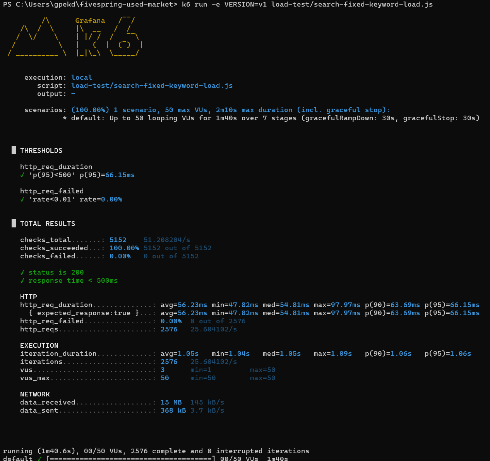


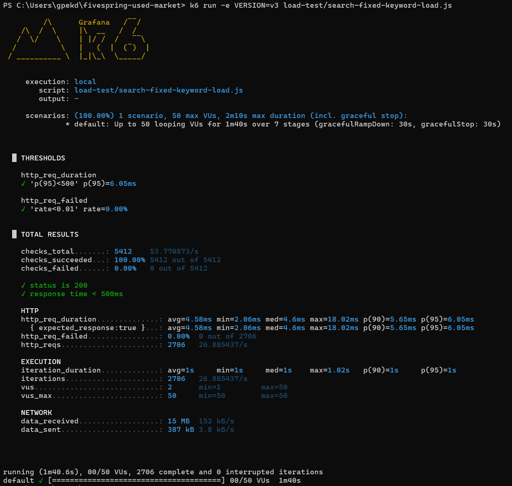

</details>

---

### 8-3. Load Test - 랜덤 키워드 반복 테스트 결과

* 검색어: 아이폰, 맥북, 갤럭시, 에어팟, 키보드, 마우스, 모니터, 가방, 나이키, 패딩
* 테스트 파일: `load-test/search-random-keyword-load.js`

| 버전 | 적용 방식 | 평균 응답 시간 (Avg) | 95% 응답 시간 (P95) | 최대 응답 시간 (Max) | 실패율 (Failed Rate) | 총 요청 수 (Total Requests) | 처리량 (RPS) |
| -- | -- | --: | --: | --: | --: | --: | --: |
| v1 | DB 직접 조회 | 55.24ms | 64.17ms | 78.27ms | 0.00% | 2,578 | 25.68 req/s |
| v2 | Caffeine 캐시 | 3.79ms | 5.24ms | 22.20ms | 0.00% | 2,708 | 26.93 req/s |
| v3 | Redis 캐시 | 4.73ms | 6.49ms | 14.84ms | 0.00% | 2,705 | 26.87 req/s |

#### 결과 해석

랜덤 키워드 테스트는 실제 사용자 검색 패턴에 더 가깝게 여러 검색어를 랜덤하게 요청하는 방식으로 진행했다.

테스트 결과, v1은 평균 응답 시간이 55.24ms로 측정되었다. v2는 평균 3.79ms, v3는 평균 4.73ms로 측정되어 랜덤 키워드 요청에서도 캐시 적용 버전이 DB 직접 조회 방식보다 빠른 응답 시간을 보였다.

랜덤 키워드 테스트는 고정 키워드 테스트보다 캐시 Hit 비율이 낮아질 수 있다. 하지만 이번 테스트에서는 제한된 키워드 목록 안에서 반복 요청이 발생했기 때문에 v2와 v3 모두 캐시 효과가 안정적으로 나타났다.

<details>
<summary>랜덤 키워드 테스트 원본 결과</summary>

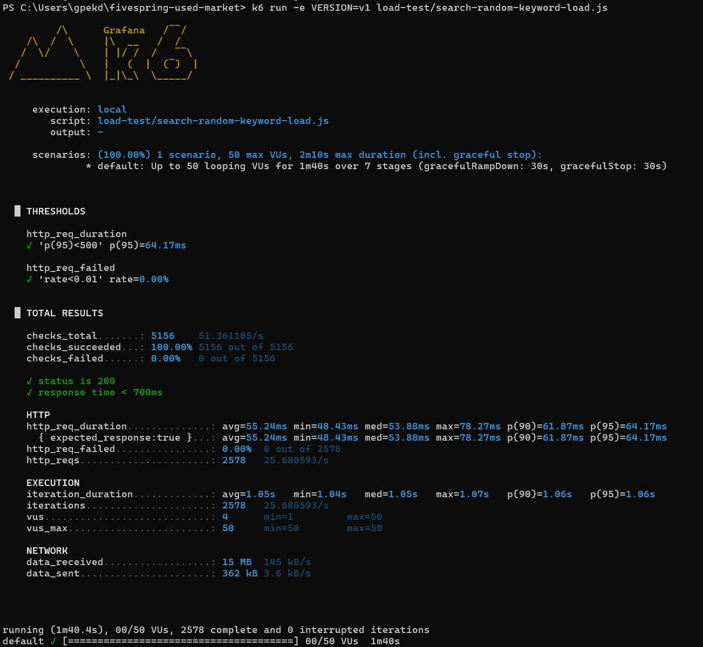

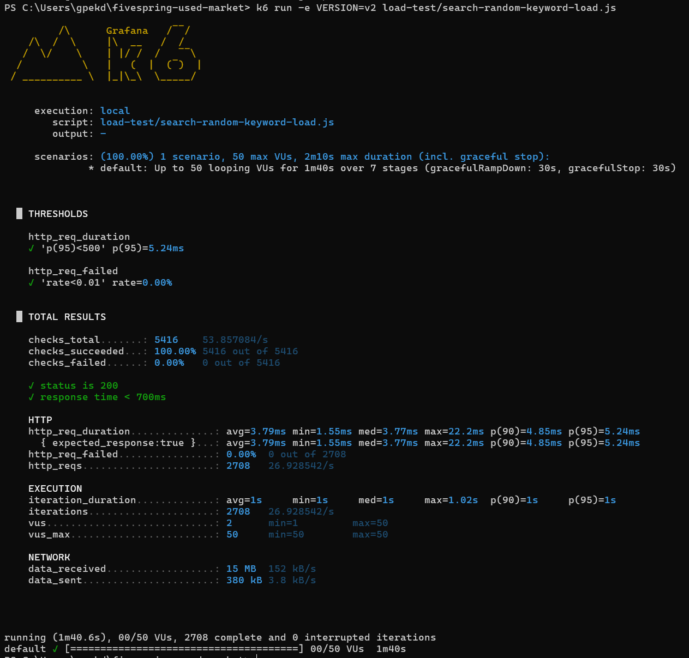

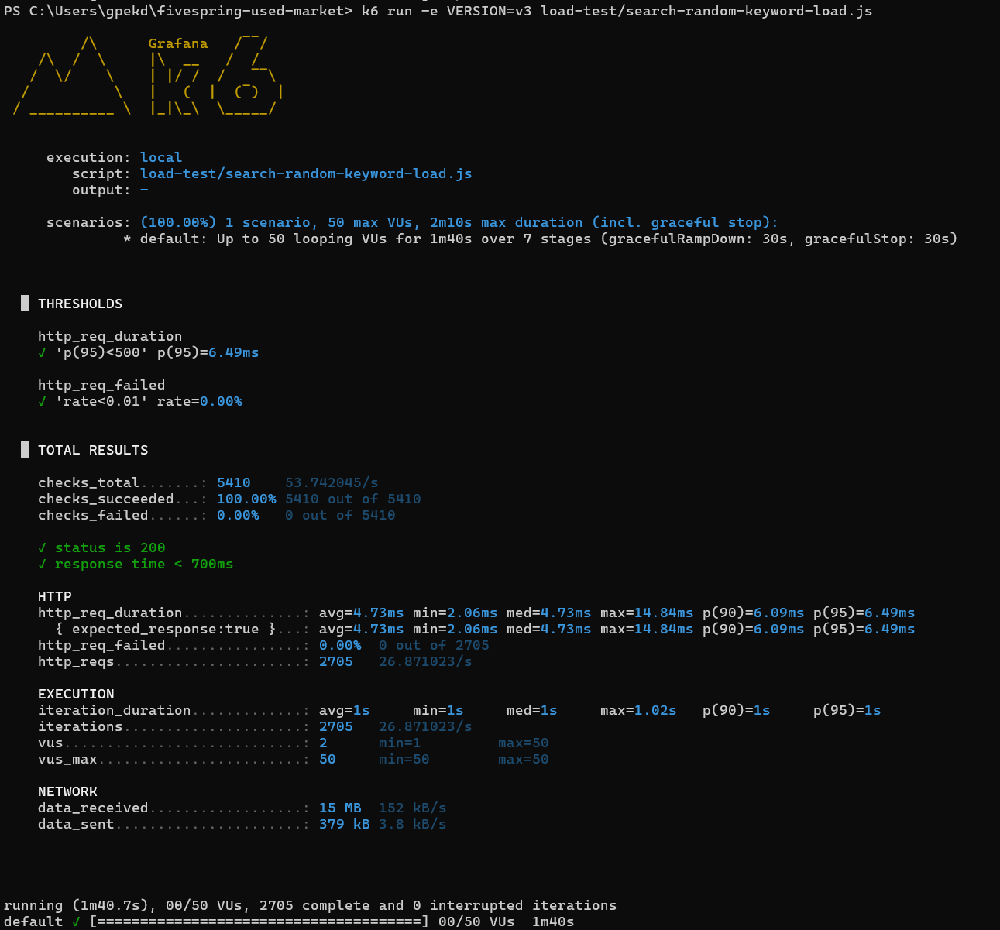

</details>

---

### 8-4. Cache Hit Ratio 측정 결과

응답 시간뿐 아니라 캐시가 실제로 얼마나 재사용되었는지 확인하기 위해 Cache Hit Ratio를 측정했다.

Cache Hit Ratio는 캐시가 워밍업된 상태에서 측정했다.  
테스트 전 캐시 데이터는 유지하고 Hit/Miss 통계만 초기화한 뒤 동일한 검색 시나리오를 실행했다.

| 테스트 유형 | 캐시 방식 | Hit | Miss | Total | Hit Ratio |
| -- | -- | --: | --: | --: | --: |
| 고정 키워드 테스트 | Caffeine 캐시 | 2,708 | 1 | 2,709 | 99.96% |
| 고정 키워드 테스트 | Redis 캐시 | 2,700 | 1 | 2,701 | 99.96% |
| 랜덤 키워드 테스트 | Caffeine 캐시 | 2,708 | 0 | 2,708 | 100.00% |
| 랜덤 키워드 테스트 | Redis 캐시 | 2,691 | 10 | 2,701 | 99.63% |

#### 결과 해석

Caffeine 캐시의 경우 고정 키워드 테스트에서 총 2,709건 중 2,708건이 Hit로 처리되었고, Hit Ratio는 99.96%로 측정되었다.  
랜덤 키워드 테스트에서는 총 2,708건이 모두 Hit로 처리되어 Hit Ratio가 100.00%로 측정되었다.

Redis 캐시의 경우 고정 키워드 테스트에서 총 2,701건 중 2,700건이 Hit로 처리되었고, Hit Ratio는 99.96%로 측정되었다.  
랜덤 키워드 테스트에서는 총 2,701건 중 2,691건이 Hit로 처리되었고, Miss는 10건 발생하여 Hit Ratio는 99.63%로 측정되었다.

고정 키워드 테스트는 동일한 검색 조건이 반복되므로 최초 1회 Miss 이후 대부분의 요청이 캐시 Hit로 처리된 것으로 판단했다.  
랜덤 키워드 테스트는 10개의 검색어를 랜덤하게 요청하는 방식이므로, Redis 캐시에서는 각 검색어별 최초 요청에서 Miss가 발생하고 이후 반복 요청은 Hit로 처리된 것으로 판단했다.

이를 통해 Caffeine 캐시와 Redis 캐시 모두 반복 검색 요청에서 정상적으로 재사용되고 있음을 확인했다.

<details>
<summary>Cache Hit Ratio 원본 결과</summary>

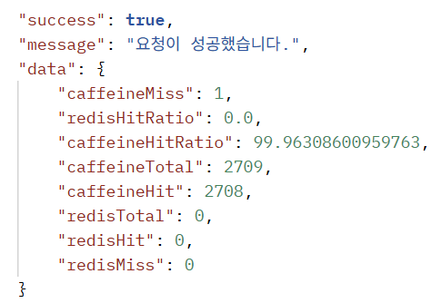

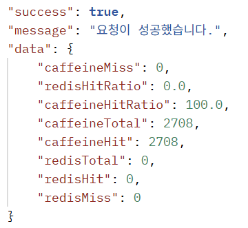

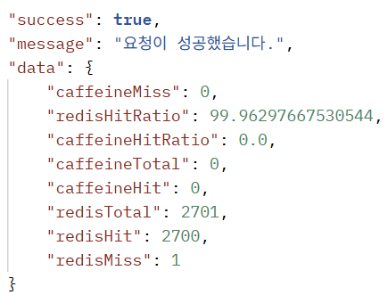

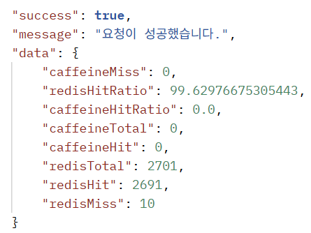

</details>

---

### 8-5. Stress Test 결과

* 테스트 파일: `load-test/search-stress-test.js`
* 최대 VU: 300
* sleep: 1초

| 버전 | 적용 방식 | 평균 응답 시간 (Avg) | 95% 응답 시간 (P95) | 최대 응답 시간 (Max) | 실패율 (Failed Rate) | 총 요청 수 (Total Requests) | 처리량 (RPS) | 결과 |
| -- | -- | --: | --: | --: | --: | --: | --: | -- |
| v1 | DB 직접 조회 | 572.87ms | 1.39s | 2.74s | 0.00% | 20,777 | 94.11 req/s | 응답 시간 기준 초과 |
| v2 | Caffeine 캐시 | 4.32ms | 7.08ms | 57.42ms | 0.00% | 32,478 | 147.09 req/s | 안정 |
| v3 | Redis 캐시 | 5.44ms | 10.07ms | 123.27ms | 0.00% | 32,440 | 146.93 req/s | 안정 |

#### 결과 해석

Stress Test 결과, v1은 HTTP 요청 실패율은 0.00%였지만 P95 응답 시간이 1.39초로 증가하여 기준값인 1초를 초과했다.

반면 v2와 v3는 동일한 300 VU 조건에서도 각각 P95 7.08ms, 10.07ms로 안정적인 응답 시간을 유지했다.

이를 통해 DB 직접 조회 방식은 고부하 상황에서 응답 시간이 크게 증가할 수 있지만, 캐시 적용 방식은 동일 조건에서 안정적인 응답 시간을 유지할 수 있음을 확인했다.

<details>
<summary>Stress Test 원본 결과</summary>

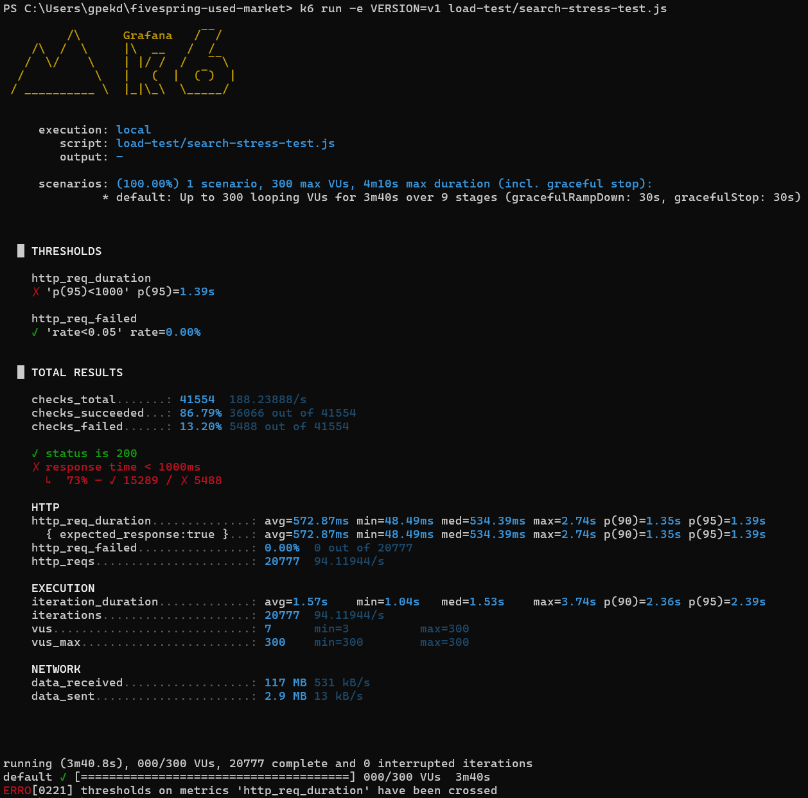

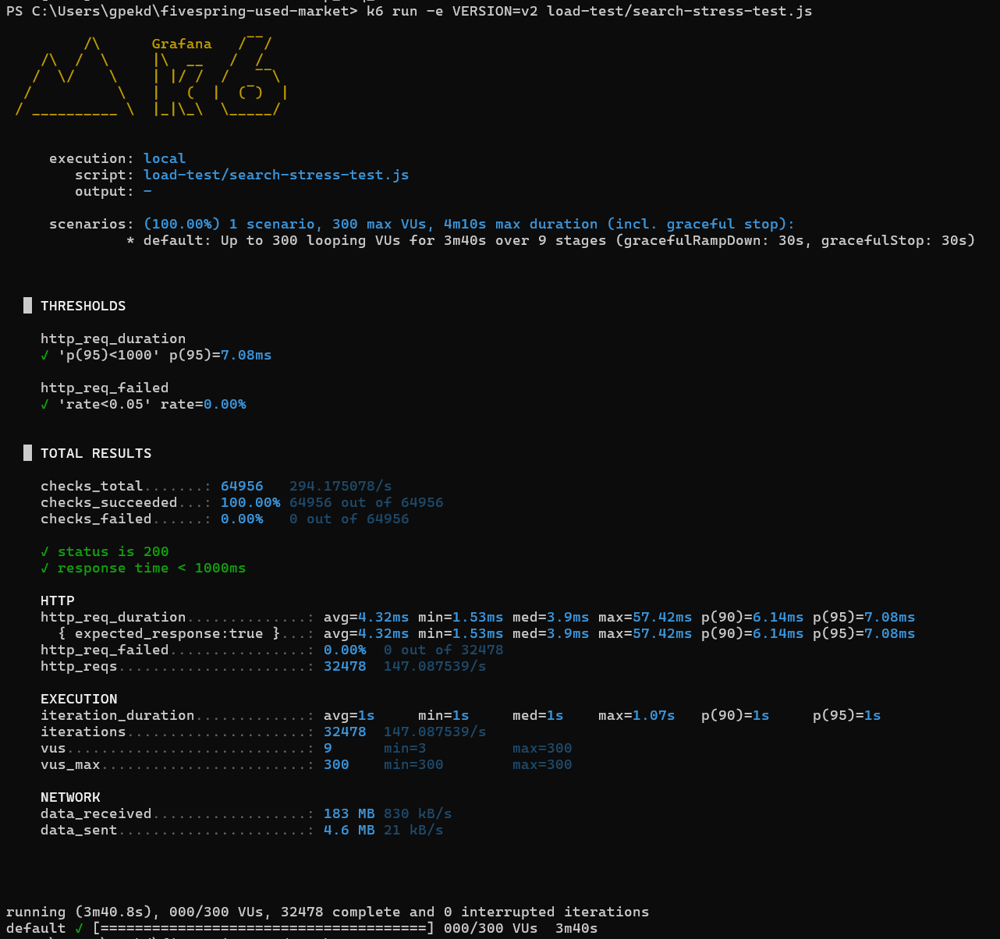

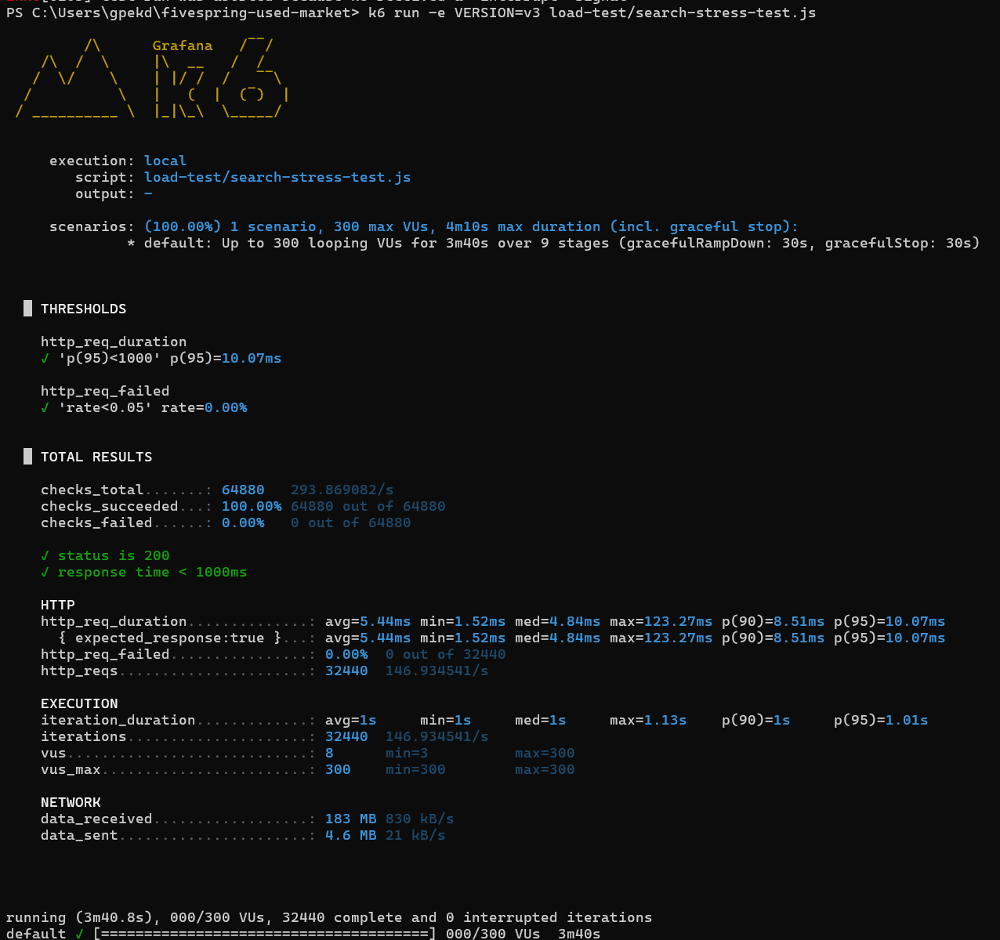

</details>

---

### 8-6. Breaking Point Test 결과

* 테스트 파일: `load-test/search-breaking-point-test.js`
* 최대 VU: 1,000
* sleep: 없음

| 버전 | 적용 방식 | 평균 응답 시간 (Avg) | 95% 응답 시간 (P95) | 최대 응답 시간 (Max) | 실패율 (Failed Rate) | 총 요청 수 (Total Requests) | 처리량 (RPS) | 결과 |
| -- | -- | --: | --: | --: | --: | --: | --: | -- |
| v1 | DB 직접 조회 | 2.92s | 7.02s | 8.68s | 0.00% | 22,379 | 139.84 req/s | 응답 시간 기준 초과 |
| v2 | Caffeine 캐시 | 101.81ms | 245.66ms | 378.47ms | 0.00% | 618,263 | 3864.12 req/s | 안정 |
| v3 | Redis 캐시 | 144.35ms | 342.23ms | 424.10ms | 0.00% | 436,349 | 2727.16 req/s | 안정 |

#### 결과 해석

1000 VU Breaking Point Test에서 v1은 P95가 7.02초까지 증가하여 응답 시간 기준을 크게 초과했다.

반면 v2와 v3는 sleep 없이 1000 VU까지 요청을 지속했음에도 P95가 1초 미만으로 유지되었다.

특히 v2는 약 3864 req/s, v3는 약 2727 req/s의 처리량을 보였다.  
이를 통해 단일 서버 로컬 환경에서는 Caffeine 캐시가 Redis 캐시보다 더 높은 처리량을 보였다.

<details>
<summary>Breaking Point Test 원본 결과</summary>

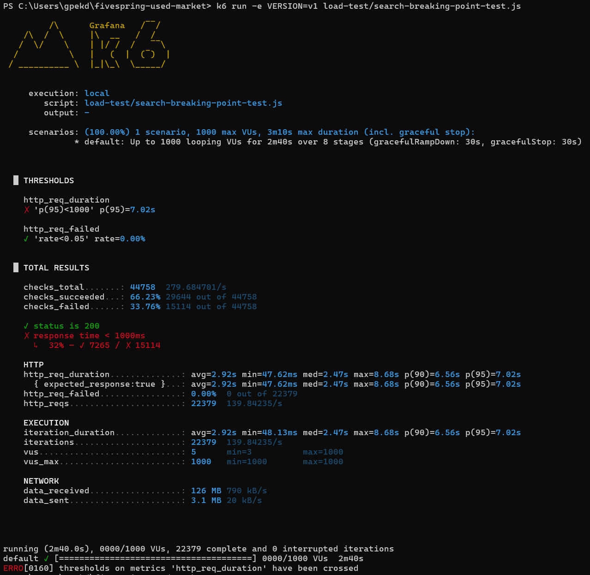

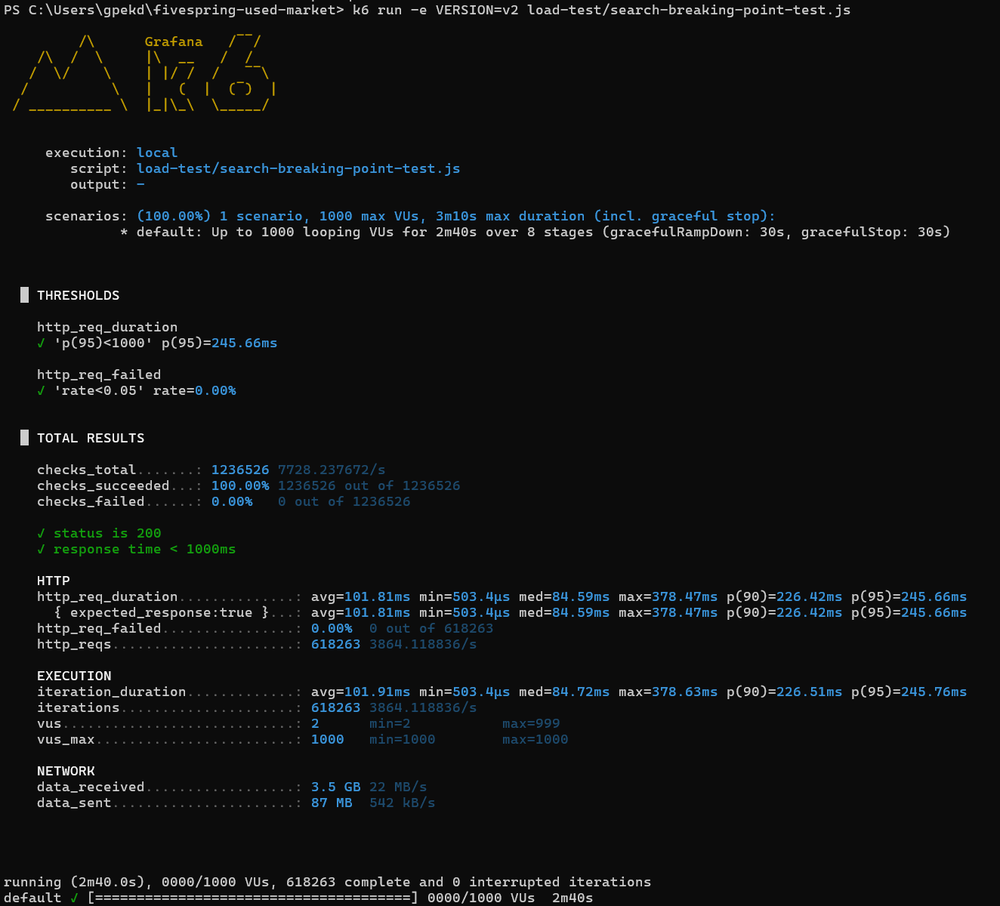

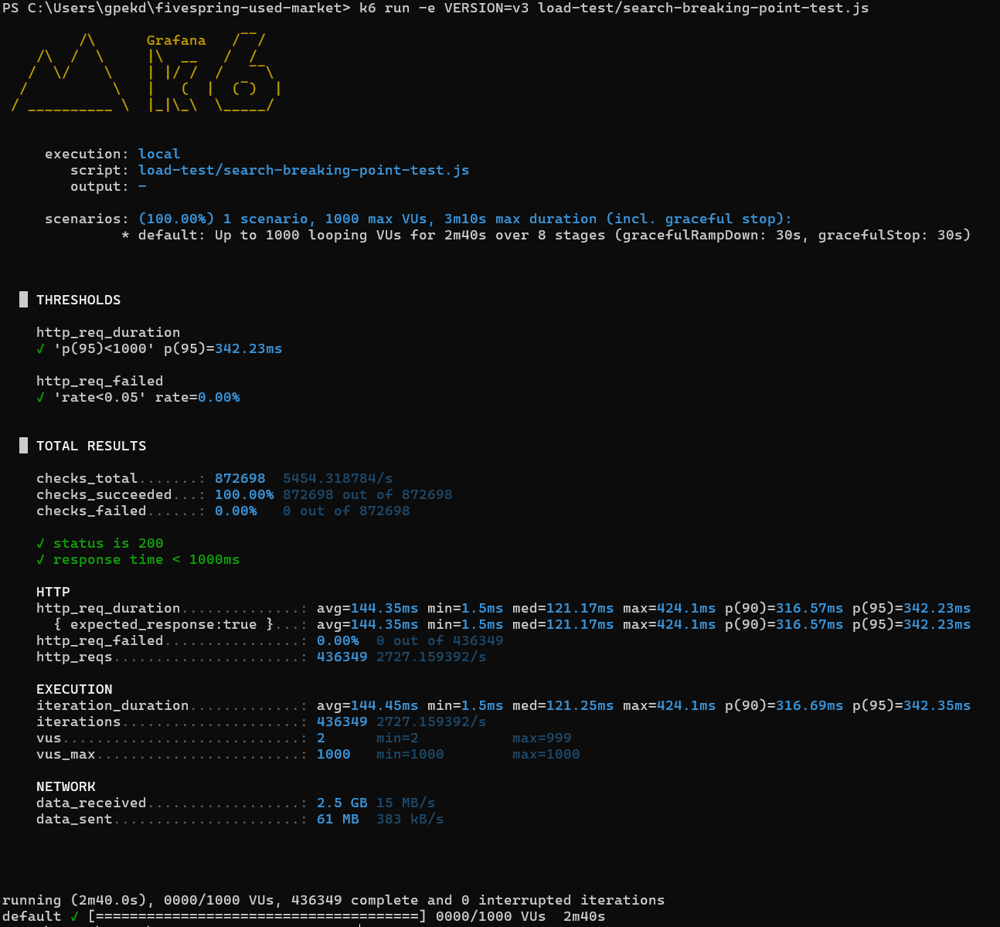

</details>

---

### 8-7. Breaking Point Heavy Test 결과

* 테스트 파일: `load-test/search-breaking-point-heavy-test.js`
* 최대 VU: 5,000
* sleep: 없음

| 버전 | 적용 방식 | 평균 응답 시간 (Avg) | 95% 응답 시간 (P95) | 최대 응답 시간 (Max) | 실패율 (Failed Rate) | 총 요청 수 (Total Requests) | 처리량 (RPS) | 결과 |
| -- | -- | --: | --: | --: | --: | --: | --: | -- |
| v1 | DB 직접 조회 | 16.56s | 35.61s | 37.93s | 0.00% | 17,077 | 133.71 req/s | 한계 초과 |
| v2 | Caffeine 캐시 | 572.03ms | 1.32s | 1.49s | 0.00% | 387,574 | 3875.59 req/s | 응답 시간 기준 초과 |
| v3 | Redis 캐시 | 777.72ms | 1.67s | 1.87s | 0.00% | 285,918 | 2859.00 req/s | 응답 시간 기준 초과 |

#### 결과 해석

5000 VU Heavy Test에서는 v1뿐 아니라 v2, v3도 P95 1초 기준을 초과했다.

다만 HTTP 요청 실패율은 세 버전 모두 0.00%로 유지되어, 서버가 오류를 반환하지는 않았지만 응답 시간이 크게 증가한 것으로 확인되었다.

v2는 1000 VU 테스트에서는 P95 245.66ms로 안정적이었으나, 5000 VU에서는 P95가 1.32초로 증가했다.  
v3 역시 1000 VU 테스트에서는 P95 342.23ms였지만, 5000 VU에서는 P95가 1.67초로 증가했다.

따라서 로컬 테스트 환경 기준으로 v2와 v3는 1000 VU까지는 안정적인 응답 시간을 유지했지만, 5000 VU 조건에서는 응답 시간 기준을 초과했다.

<details>
<summary>Breaking Point Heavy Test 원본 결과</summary>


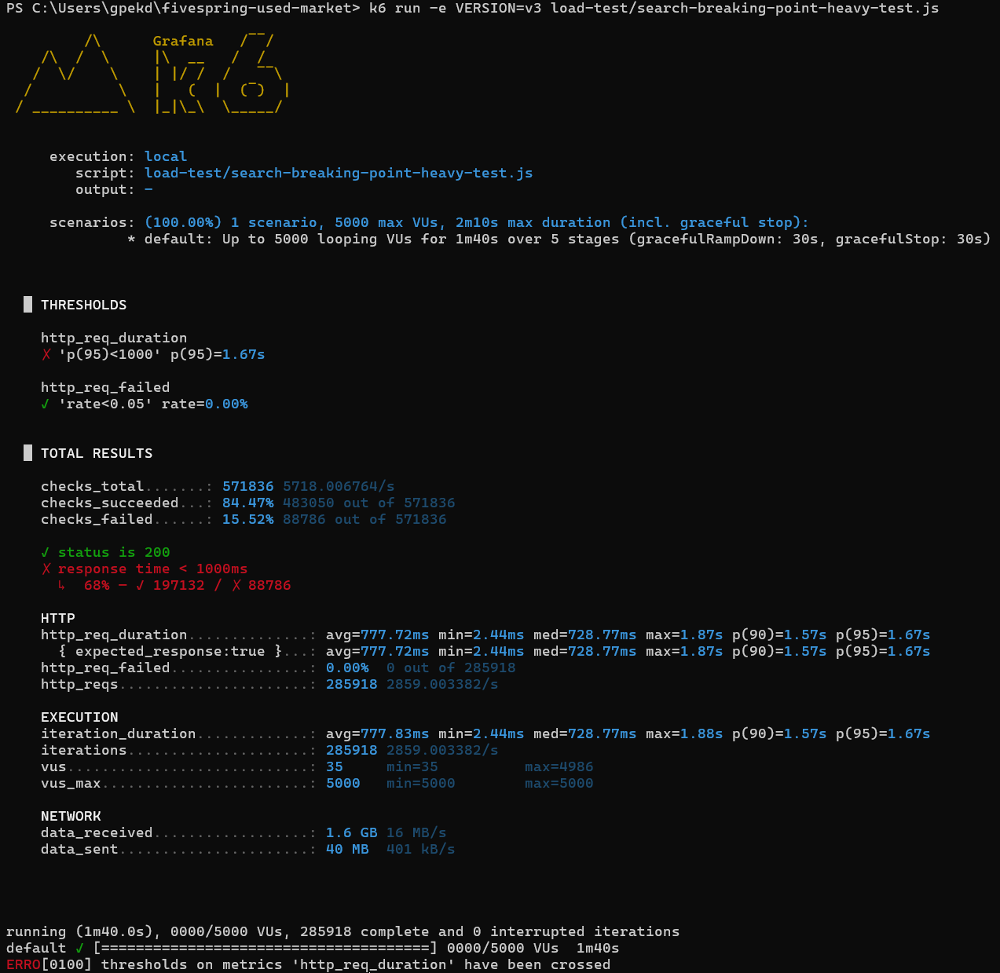

</details>

---

## 9. 종합 분석

검색 API 성능 테스트 결과, 캐시를 적용한 v2와 v3는 캐시를 사용하지 않는 v1보다 응답 시간이 크게 감소했다.

### Load Test 분석

| 비교 항목 | 고정 키워드 평균 응답 시간 기준 | 랜덤 키워드 평균 응답 시간 기준 |
| -- | --: | --: |
| v1 대비 v2 | 약 93.38% 감소 | 약 93.14% 감소 |
| v1 대비 v3 | 약 91.85% 감소 | 약 91.44% 감소 |
| v3 대비 v2 | 약 18.78% 더 빠름 | 약 19.87% 더 빠름 |

Load Test 결과, 최대 50 VU 조건에서는 v1, v2, v3 모두 실패율 0.00%로 안정적으로 동작했다.

다만 응답 시간은 캐시를 적용한 v2, v3가 v1보다 약 91~93% 낮게 측정되었다.  
이를 통해 동일하거나 유사한 검색 요청이 반복되는 상황에서 캐시 적용이 검색 API 응답 시간을 크게 줄일 수 있음을 확인했다.

### Cache Hit Ratio 분석

Caffeine 캐시는 고정 키워드 테스트에서 99.96%, 랜덤 키워드 테스트에서 100.00%의 Hit Ratio를 보였다.

Redis 캐시는 고정 키워드 테스트에서 99.96%, 랜덤 키워드 테스트에서 99.63%의 Hit Ratio를 보였다.

이는 Caffeine과 Redis 모두 반복 검색 요청에서 캐시가 정상적으로 재사용되고 있음을 의미한다.

고정 키워드 테스트는 동일한 검색 조건이 반복되기 때문에 최초 Miss 이후 대부분의 요청이 Hit로 처리되었다.  
랜덤 키워드 테스트는 10개의 검색어를 랜덤하게 요청했기 때문에, 각 검색어가 처음 조회될 때 일부 Miss가 발생하고 이후 반복 요청은 Hit로 처리되었다.

다만 실제 서비스에서는 검색어, 필터, 정렬, 페이지 조건 조합이 더 다양하므로 Hit Ratio는 이번 테스트보다 낮아질 수 있다.

### Stress Test 분석

Stress Test 결과, 최대 300 VU 조건에서 v1은 P95 응답 시간이 1.39초로 증가하여 기준값인 1초를 초과했다.

반면 v2와 v3는 각각 P95 7.08ms, 10.07ms로 안정적인 응답 시간을 유지했다.

이를 통해 DB 직접 조회 방식은 고부하에서 응답 시간이 크게 증가했지만, 캐시 적용 방식은 동일한 조건에서 안정적인 응답 시간을 유지할 수 있음을 확인했다.

### Breaking Point Test 분석

Breaking Point Test 결과, v1은 1000 VU 조건에서 이미 P95 7.02초로 크게 증가했다.

v2와 v3는 1000 VU까지는 P95 1초 미만으로 유지되었으나, 5000 VU Heavy Test에서는 각각 P95 1.32초, 1.67초로 증가하여 응답 시간 기준을 초과했다.

따라서 로컬 테스트 환경 기준으로 v1은 300~1000 VU 구간에서 응답 시간 한계가 나타났고, v2와 v3는 1000~5000 VU 사이에서 응답 시간 한계가 나타난 것으로 판단했다.

### Caffeine 캐시와 Redis 캐시 비교

v2가 v3보다 빠른 이유는 Caffeine이 애플리케이션 내부 메모리에서 데이터를 직접 조회하기 때문이다.

반면 Redis는 외부 캐시 저장소와 통신해야 하므로 네트워크 통신 및 직렬화/역직렬화 비용이 추가될 수 있다.

다만 Redis는 여러 서버 인스턴스가 동일한 캐시를 공유할 수 있으므로, 단일 서버 환경에서는 Caffeine이 유리하고 다중 서버 환경에서는 Redis가 더 적합할 수 있다.

---

## 10. 결론

5만 건의 상품 데이터가 적재된 환경에서 검색 API v1, v2, v3의 성능을 비교했다.

Load Test 결과, Caffeine 캐시를 적용한 v2는 v1 대비 평균 응답 시간이 약 93% 감소했고, Redis 캐시를 적용한 v3는 v1 대비 약 91% 감소했다.

Cache Hit Ratio 측정 결과, Caffeine 캐시는 고정 키워드 테스트에서 99.96%, 랜덤 키워드 테스트에서 100.00%의 Hit Ratio를 보였다.

Redis 캐시는 고정 키워드 테스트에서 99.96%, 랜덤 키워드 테스트에서 99.63%의 Hit Ratio를 보였다.

이를 통해 Caffeine과 Redis 모두 반복 검색 요청에서 캐시가 실제로 재사용되고 있음을 확인했다.

Stress Test 결과, v1은 300 VU에서 P95 응답 시간이 1초를 초과했지만, v2와 v3는 동일 조건에서 안정적인 응답 시간을 유지했다.

Breaking Point Test 결과, v1은 1000 VU 조건에서 이미 응답 시간 기준을 크게 초과했다.  
반면 v2와 v3는 1000 VU까지는 P95 1초 미만으로 유지되었고, 5000 VU Heavy Test에서 각각 P95 1.32초, 1.67초로 증가하며 응답 시간 기준을 초과했다.

이를 통해 캐시 적용이 단순히 평균 응답 시간을 줄이는 것뿐만 아니라, 고부하 상황에서도 검색 API의 응답 시간 안정성을 높이는 데 효과가 있음을 확인했다.

최종적으로 로컬 단일 서버 환경에서는 Caffeine 캐시가 가장 빠른 응답 속도와 높은 처리량을 보였으며, Redis 캐시는 Caffeine보다 소폭 느렸지만 다중 서버 환경에서 캐시 공유가 가능하다는 장점이 있다.

따라서 단일 서버 환경에서는 Caffeine 캐시가 응답 속도 측면에서 가장 유리하고, 다중 서버 환경이나 캐시 공유가 필요한 경우 Redis 캐시가 더 적합하다고 판단했다.

---

## 11. 한계 및 추후 개선 방향

이번 테스트는 로컬 환경에서 진행되었기 때문에 운영 환경과 동일한 성능 결과라고 보기는 어렵다.

특히 Spring Boot 서버, MySQL, Redis, k6 부하 발생기가 모두 동일 PC에서 실행되었기 때문에, 고부하 테스트에서는 서버 자체의 한계와 로컬 테스트 환경의 한계를 명확히 분리하기 어렵다.

또한 Cache Hit Ratio는 제한된 검색어 목록과 동일한 페이지 조건을 기준으로 측정했다.  
실제 서비스에서는 검색어, 필터, 정렬, 페이지 번호 조합이 더 다양하게 발생하므로 실제 Hit Ratio는 이번 테스트보다 낮아질 수 있다.

추후에는 다음 항목을 추가로 확인할 수 있다.

* 더 다양한 검색 조건을 사용한 Cache Hit Ratio 측정
* DB Query Count 측정
* Redis Memory 사용량 확인
* Prometheus, Grafana를 통한 CPU, Memory, GC, Thread 모니터링
* Hikari Pool, Tomcat Thread 등 서버 설정 튜닝 후 재측정
* 별도의 부하 발생 서버를 사용한 운영 환경에 가까운 성능 테스트